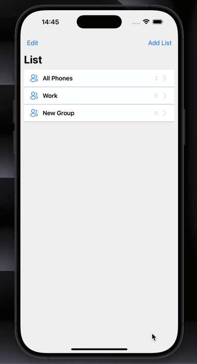

# 📱 React Native Contacts App (iOS Style)

A mobile application built with **React Native**, mimicking the native iOS Contacts app. It enables users to perform complete **CRUD operations** on a **SQLite database** with a **relational group structure**—each contact is linked to a group via `group_id`.

## ✨ Features

- Full **Create, Read, Update, Delete (CRUD)** functionality.
- Relational database with **group_id** associations.
- **React Navigation** for screen transitions.
- **Redux Toolkit** for global state management.
- **Formik** and **Yup** for form handling and validation.
- **UI Kitten** for styled UI components.
- **Iconsax** for modern icons.
- iOS-inspired design and UX.

## 🧠 Tech Stack

| Package                         | Purpose                                 |
|----------------------------------|------------------------------------------|
| `react-native-sqlite-storage`   | Local SQLite database integration        |
| `@reduxjs/toolkit`              | State management                         |
| `react-redux`                   | React bindings for Redux                 |
| `@react-navigation/native`      | Screen navigation                        |
| `@react-navigation/native-stack`| Stack-based navigation                   |
| `formik` + `yup`                | Form state & validation                  |
| `@ui-kitten/components`         | UI components                            |
| `iconsax-react-native`          | Icon library                             |
| `react-native-svg`              | SVG and vector graphics support          |
| `react-native-screens` & `react-native-safe-area-context` | Layout and safe areas |

## 📸 Demo

